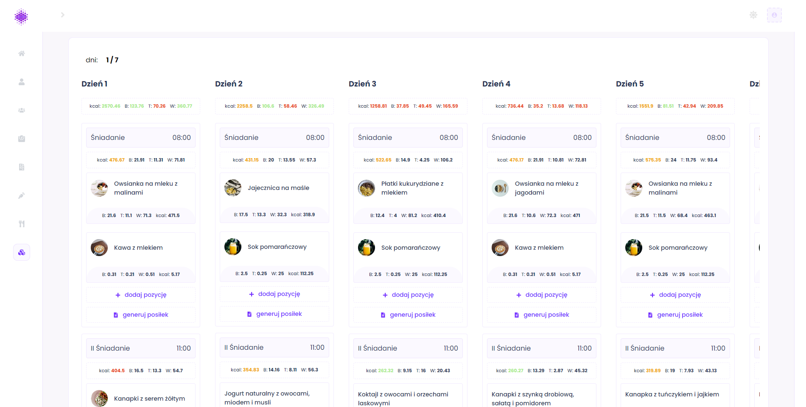
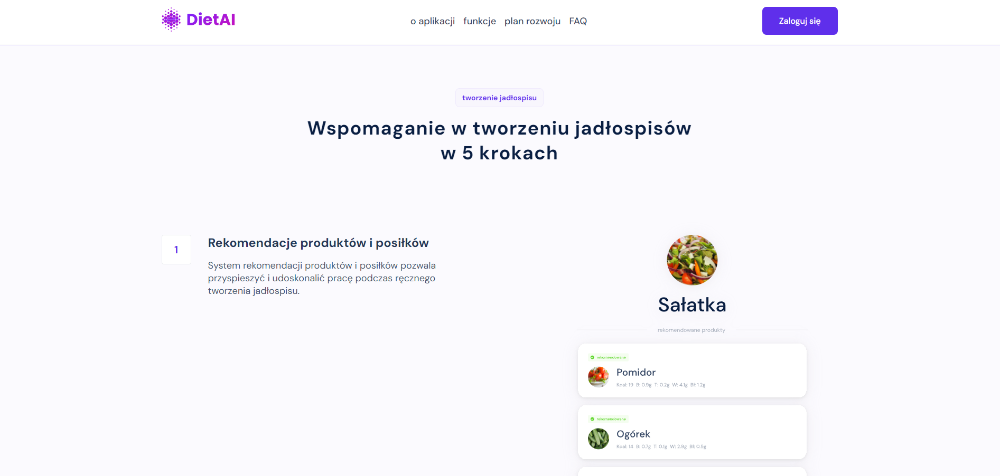
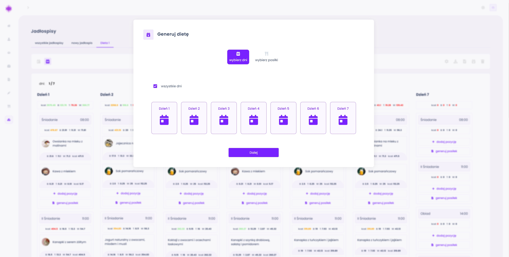
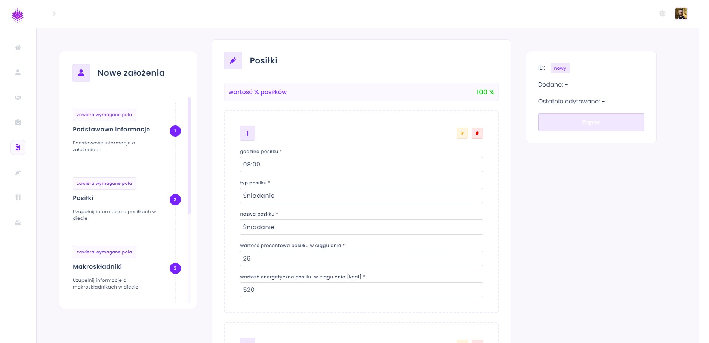
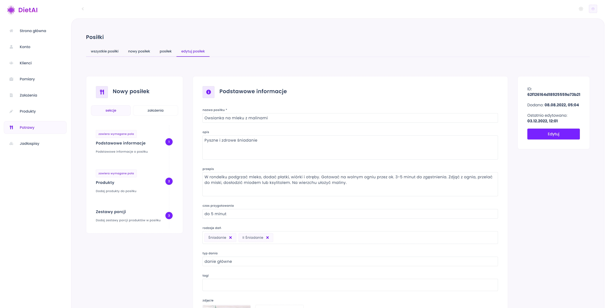
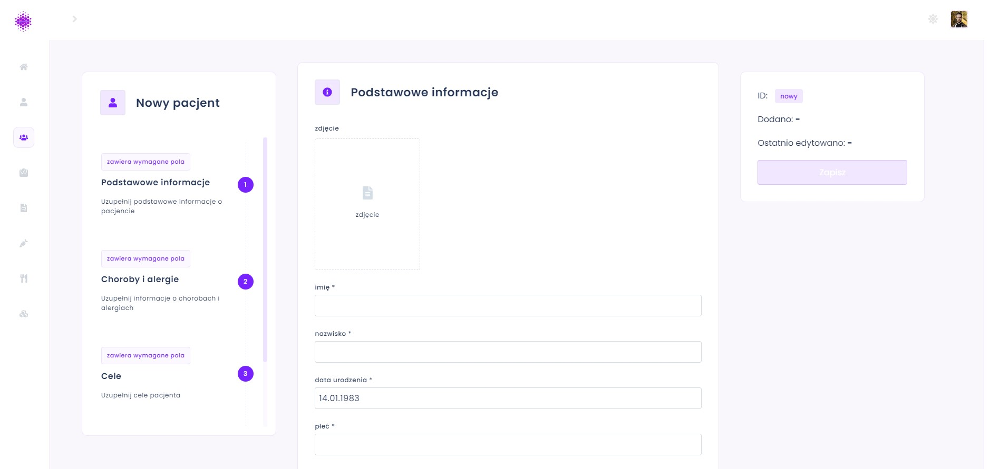
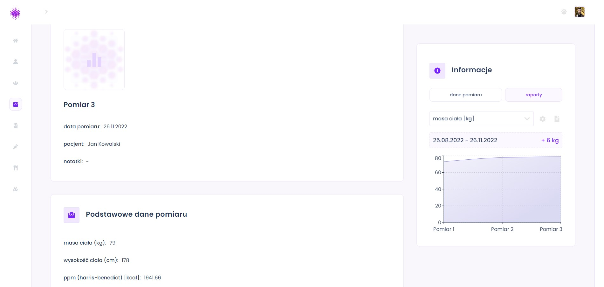
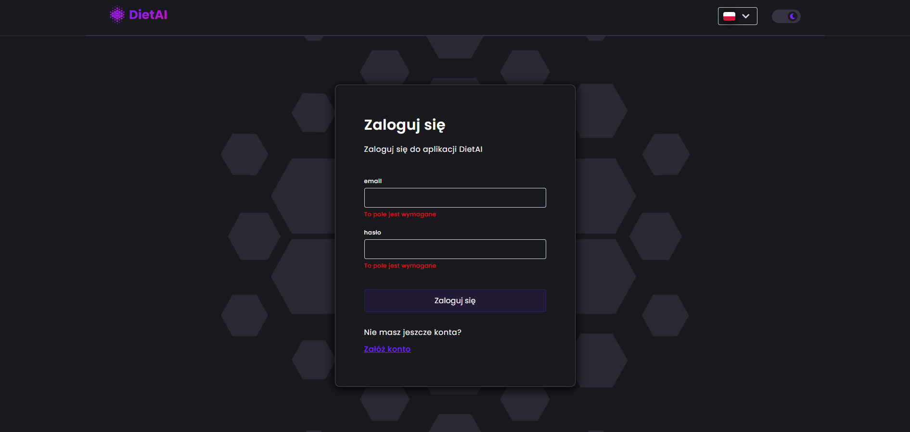

<h1 align="center">DietAI</h1>















## Project Overview

The application is used for manually or automatically generating meals and personalized meal plans, utilizing machine learning algorithms, among other things. In the application, you can also add clients, goals, interviews, and nutritional assumptions, as well as create client reports. [backend repository](https://github.com/DIETAI/backend.git)

## Tech used

| Tech                                               | Description                                          |
| -------------------------------------------------- | ---------------------------------------------------- |
| [React](https://react.dev/)                        | The library for web and native user interfaces       |
| [Typescript](https://www.typescriptlang.org/)      | Javascript superset language                         |
| [Styled Components](https://styled-components.com) | CSS-in-JS styling framework                          |
| [SWR](https://swr.vercel.app/)                     | React Hooks for Data Fetching                        |
| [React Hook Form](https://react-hook-form.com/)    | React Hooks for form state management and validation |
| [Framer Motion](https://www.framer.com/motion/)    | Motion library for React                             |

## Live

The landing page is hosted on Vercel.

https://dietai.mederak.com

The application's dashboard frontend is hosted on DigitalOcean.

https://dashboard.dietai.mederak.com

## Credentials

If you don't want to register, use this data:

- Email: john.doe@gmail.com
- Password: johnXdoe101



## Installation

```bash
git clone https://github.com/DIETAI/frontend.git
npm install
# set up environment variables
The following environment variables are used in this project:

- `REACT_APP_BACKEND_URL`: The URL to the hosted backend of the application.
- `REACT_APP_RECOMMEND_SERVER_URL`: The URL to the hosted recommend products and meals flask backend.


To configure these variables, create a `.env.local` file in the root of your project.

npm run start
```

## Available Scripts

In the project directory, you can run:

### `npm start`

Runs the app in the development mode.\
Open [http://localhost:3000](http://localhost:3000) to view it in the browser.

The page will reload if you make edits.\
You will also see any lint errors in the console.

### `npm test`

Launches the test runner in the interactive watch mode.\
See the section about [running tests](https://facebook.github.io/create-react-app/docs/running-tests) for more information.

### `npm run build`

Builds the app for production to the `build` folder.\
It correctly bundles React in production mode and optimizes the build for the best performance.

The build is minified and the filenames include the hashes.\
Your app is ready to be deployed!

See the section about [deployment](https://facebook.github.io/create-react-app/docs/deployment) for more information.

### `npm run eject`

**Note: this is a one-way operation. Once you `eject`, you can’t go back!**

If you aren’t satisfied with the build tool and configuration choices, you can `eject` at any time. This command will remove the single build dependency from your project.

Instead, it will copy all the configuration files and the transitive dependencies (webpack, Babel, ESLint, etc) right into your project so you have full control over them. All of the commands except `eject` will still work, but they will point to the copied scripts so you can tweak them. At this point you’re on your own.

You don’t have to ever use `eject`. The curated feature set is suitable for small and middle deployments, and you shouldn’t feel obligated to use this feature. However we understand that this tool wouldn’t be useful if you couldn’t customize it when you are ready for it.
